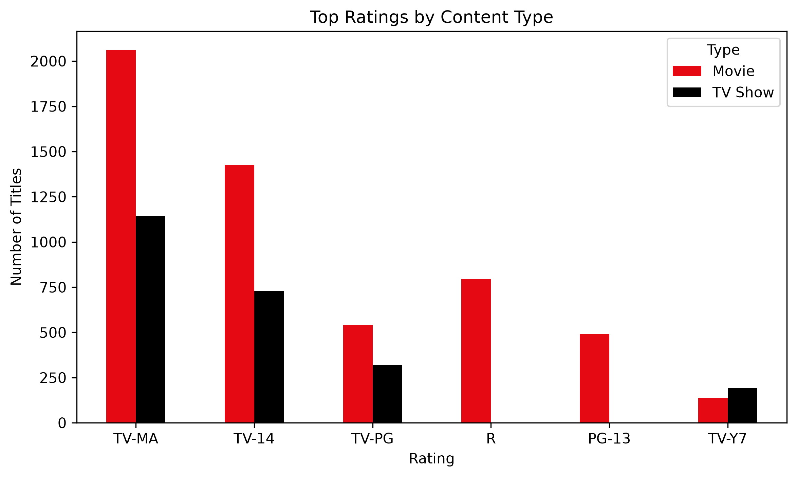
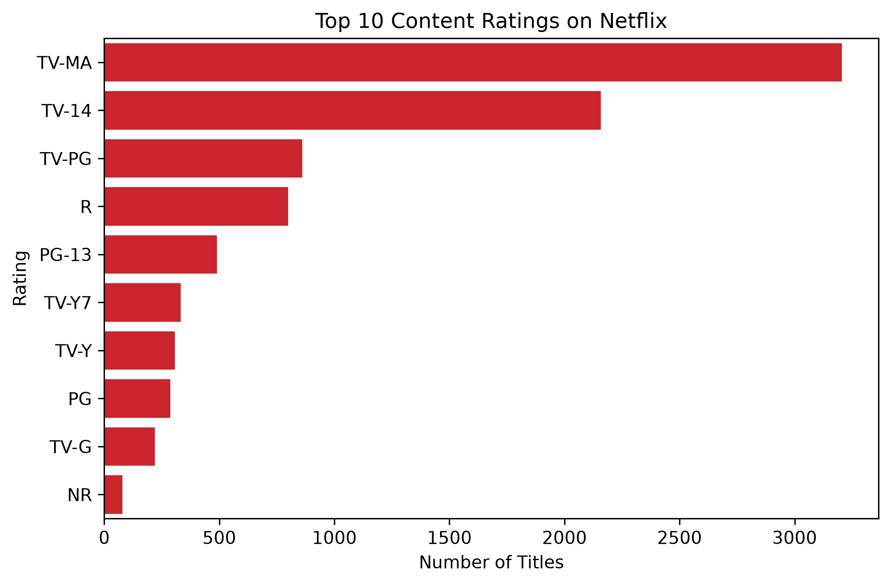
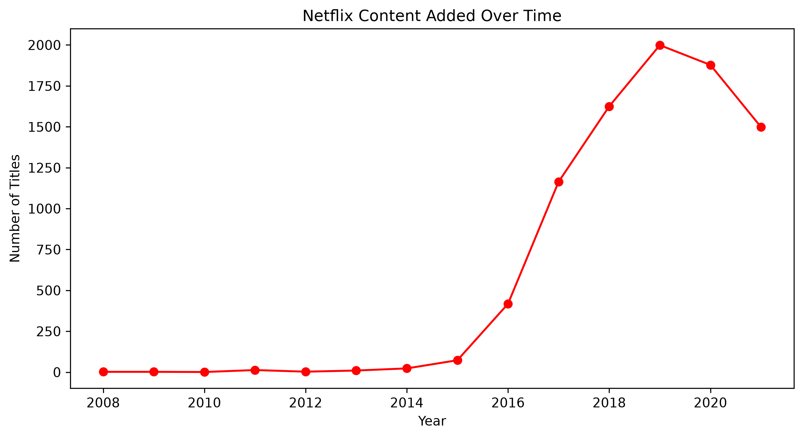
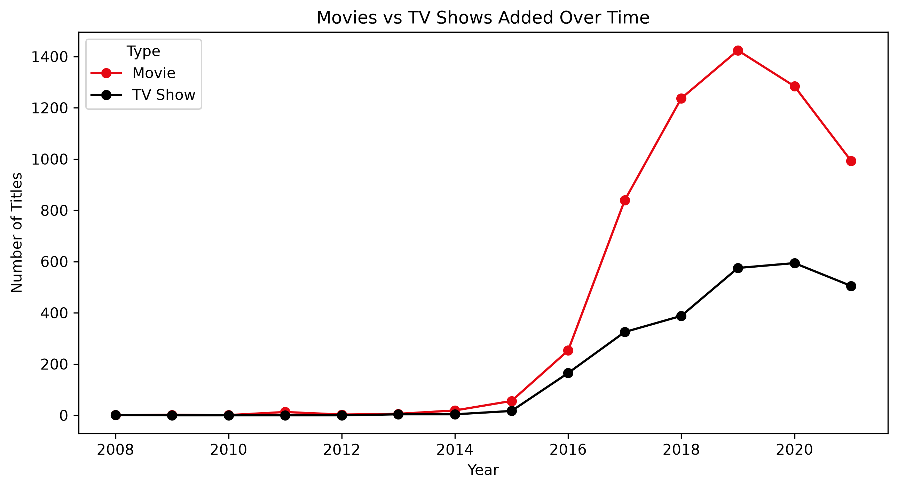
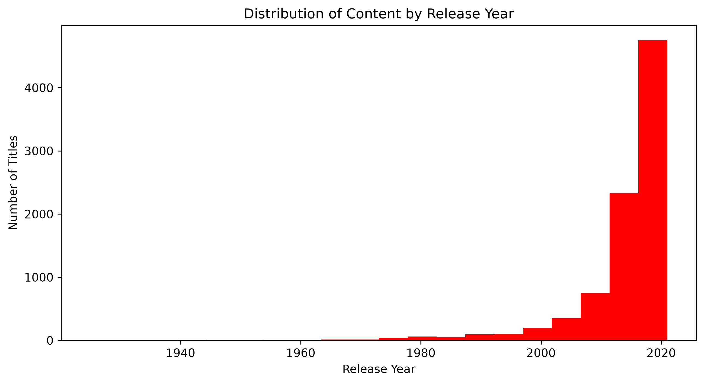
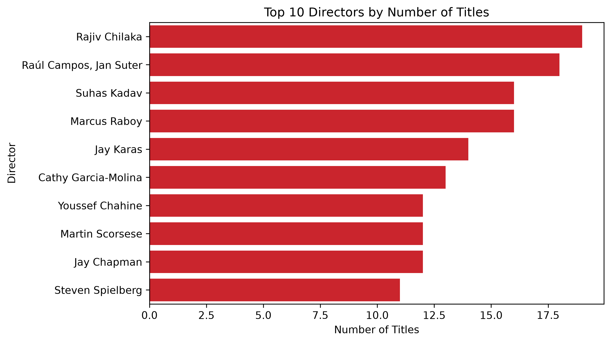

# 🎬 Netflix Data Analysis – Exploratory Data Analysis (EDA)

An exploratory data analysis (EDA) project on Netflix's Movies & TV Shows catalog, built in Python using Pandas, NumPy, Matplotlib, and Seaborn. The project cleans the raw dataset and analyzes it to uncover trends in content type, ratings, release years, and directors.

**Dataset source:** [Netflix Movies and TV Shows – Kaggle](https://www.kaggle.com/datasets/shivamb/netflix-shows) *(update this link if your dataset came from elsewhere)*

## 📌 About the Project

This project walks through a complete EDA workflow on a Netflix titles dataset:

- **Data cleaning** – handling missing values, fixing data types, and standardizing columns
- **Univariate & bivariate analysis** – exploring individual columns and relationships between them
- **Data visualization** – bar charts, line charts, and histograms to surface trends
- **Insight generation** – summarizing patterns in Netflix's content library

All of the analysis and code lives in the Jupyter notebook `Netflix EDA.ipynb`.

## 📂 Repository Structure

```
Netflix-Data-Analysis-EDA/
├── Netflix EDA.ipynb                   # Main Jupyter notebook with the full analysis
├── Netflix-Movies-TVshow-Sample.csv    # Raw/sample dataset
├── netflix_cleaned.csv                 # Cleaned dataset produced during the EDA
├── images/                             # Charts and visuals exported from the notebook
├── requirements.txt                    # Python dependencies
└── README.md
```

## 🛠️ Tech Stack

- **Python 3**
- **Pandas** – data manipulation and cleaning
- **NumPy** – numerical operations
- **Matplotlib** – static plotting
- **Seaborn** – statistical visualizations
- **Jupyter Notebook** – interactive analysis environment

## 🚀 Getting Started

### 1. Clone the repository

```bash
git clone https://github.com/neha-raniii/Netflix-Data-Analysis-EDA.git
cd Netflix-Data-Analysis-EDA
```

### 2. Create a virtual environment (optional but recommended)

```bash
python -m venv venv
source venv/bin/activate      # On Windows: venv\Scripts\activate
```

### 3. Install dependencies

```bash
pip install -r requirements.txt
```

### 4. Launch the notebook

```bash
jupyter notebook "Netflix EDA.ipynb"
```

## 🎯 Business Problem

Netflix has a large and diverse content library, but it's important to understand how this content is distributed across content types, ratings, release years, and directors — and how the catalog has evolved over time.

## 🎯 Business Objective

To analyze Netflix's movies and TV shows to understand its content strategy and identify key content patterns and trends.

## 🔍 Key Questions Explored

1. Which type of content is most common on Netflix — Movies or TV Shows?
2. Which content ratings dominate the platform, and does this differ by content type?
3. How has the volume of content added to Netflix changed year over year?
4. How does the release-year distribution of titles compare to when they were *added* to Netflix?
5. Which directors have the most titles on the platform?

## 💡 Insights & Recommendations

### Insight 1: Content Type Split
Movies significantly outnumber TV Shows in Netflix's catalog. Across the top content ratings alone, Movie counts run roughly **2x higher** than TV Show counts in the same rating brackets (e.g. TV-MA: ~2,060 movies vs. ~1,145 TV shows; TV-14: ~1,425 movies vs. ~730 TV shows).



**Recommendation:** Since TV Shows drive higher rewatch and retention, Netflix could weight future acquisition/production budgets more toward originals and series without abandoning its movie-heavy catalog.

### Insight 2: Content Ratings
**TV-MA** is the single most common content rating on Netflix, with roughly **3,200 titles** — about 37% of all rated content and nearly 1.5x more than the next most common rating, **TV-14** (~2,160 titles). Family-friendly ratings (TV-Y, TV-G, PG) each account for well under 500 titles.



**Recommendation:** The catalog skews toward mature audiences. If Netflix wants to grow its family/kids segment, there's a clear content gap versus the TV-MA/TV-14 concentration today.

### Insight 3: Content Added Over Time
Additions stayed under 100 titles/year through 2014, then grew sharply: ~420 in 2016, ~1,160 in 2017, ~1,630 in 2018, peaking at **~2,000 titles in 2019** — before dropping to ~1,880 (2020) and ~1,500 (2021).



**Recommendation:** The 2019 peak followed by a two-year decline suggests Netflix scaled back new additions as it shifted toward originals — worth flagging as a strategic pivot point rather than a slowdown.

### Insight 4: Movies vs. TV Shows Added Over Time
Movie additions peaked in **2019 at ~1,420 titles**, then fell to ~990 by 2021. TV Show additions peaked a year later, in **2020 at ~600 titles**, before slipping to ~500 in 2021 — a smaller decline in both absolute and relative terms than Movies.



**Recommendation:** TV Shows held up better than Movies during the post-2019 pullback, reinforcing that a shift toward series investment (Insight 1) tracks with actual platform behavior, not just rating-count share.

### Insight 5: Release Year Distribution
Most titles on Netflix were originally released after 2010, with the single largest concentration (~4,700 titles) clustered in the most recent release-year bracket. Very little content predates 1990.



**Recommendation:** Netflix's catalog is overwhelmingly modern content rather than a deep classics library — a deliberate positioning worth noting if benchmarking against competitors with larger legacy libraries.

### Insight 6: Directors
**Rajiv Chilaka** has the most titles among individually credited directors (~19), closely followed by the directing duo **Raúl Campos & Jan Suter** (~18) and **Suhas Kadav** / **Marcus Raboy** (~16 each). Note: rows with multiple co-directors were treated as a single combined entry rather than split into individual directors — exploding multi-director rows would give a more precise per-director count.



**Recommendation:** High-output directors like Rajiv Chilaka (Indian animated content) and Suhas Kadav point to regional content pipelines Netflix could lean on further when scaling non-US production.

## 📁 Dataset

The dataset used (`Netflix-Movies-TVshow-Sample.csv`) contains metadata about Netflix titles, such as title, type (Movie/TV Show), director, cast, country, date added, release year, and rating. After cleaning, the processed version is saved as `netflix_cleaned.csv`.

## 🤝 Contributing

Contributions, issues, and feature requests are welcome. Feel free to check the [issues page](https://github.com/neha-raniii/Netflix-Data-Analysis-EDA/issues) or open a pull request.

## ✍️ Author

**Neha Rani** – [@neha-raniii](https://github.com/neha-raniii)
